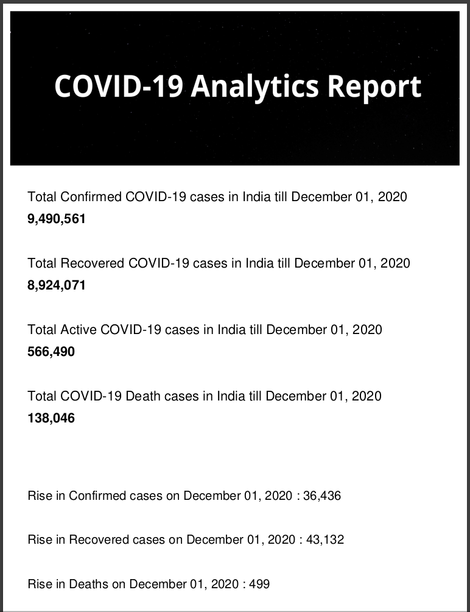

# **COVID-19 India Report generator**

---
<!--  -->


### [Covid-19 Report](https://github.com/malavmevada/Covid-19-Report-generator/blob/master/covid_report.pdf)

### This report is generated and is also sent through email automatically.


#### Here is the source data link :  [Source data](https://github.com/covid19india/api.git)
---

#### For this project you need to install some libraries.


```
$ pip install fpdf
$ pip install plotly
```

---
 - #### Whenever you run this project on your computer you have to run only create_report.py file.

 - #### Some error might occur because of sending email, you need to specify your email address and password.


- #### For automation i used Cronjob for automatic run my script on particluar time.

